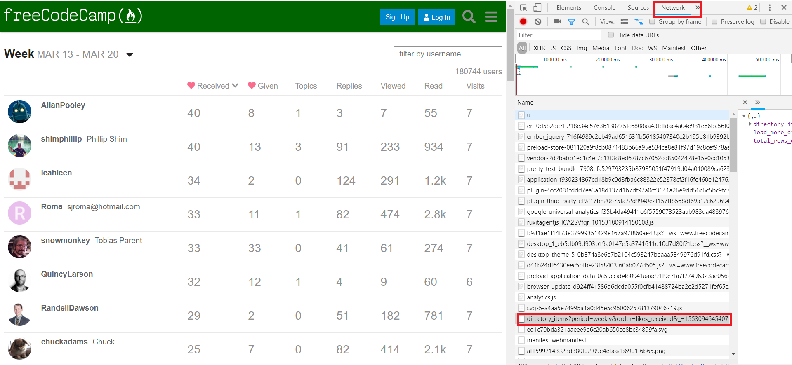

## Web Scraping With Node.js & Cheerio

[tutorial](https://www.youtube.com/watch?v=eUYMiztBEdY)

[website we are scrapping from](https://www.freecodecamp.org/forum/u)

 - inspect -> network -> directory_items 
 
 

## Cheerio

Fast, flexible & lean implementation of core jQuery designed specifically for the server.
`npm install cheerio`
[official docs](https://github.com/cheeriojs/cheerio)

## request

Request - Simplified HTTP client
[npmjs docs](https://www.npmjs.com/package/request)
`npm install request`

## request-promise

The simplified HTTP request client 'request' with Promise support. Powered by Bluebird.

Request and Bluebird are pretty awesome, but I found myself using the same design pattern. Request-Promise adds a Bluebird-powered .then(...) method to Request call objects. By default, http response codes other than 2xx will cause the promise to be rejected. This can be overwritten by setting options.simple = false.

## cli-table
This utility allows you to render unicode-aided tables on the command line from your node.js scripts.

